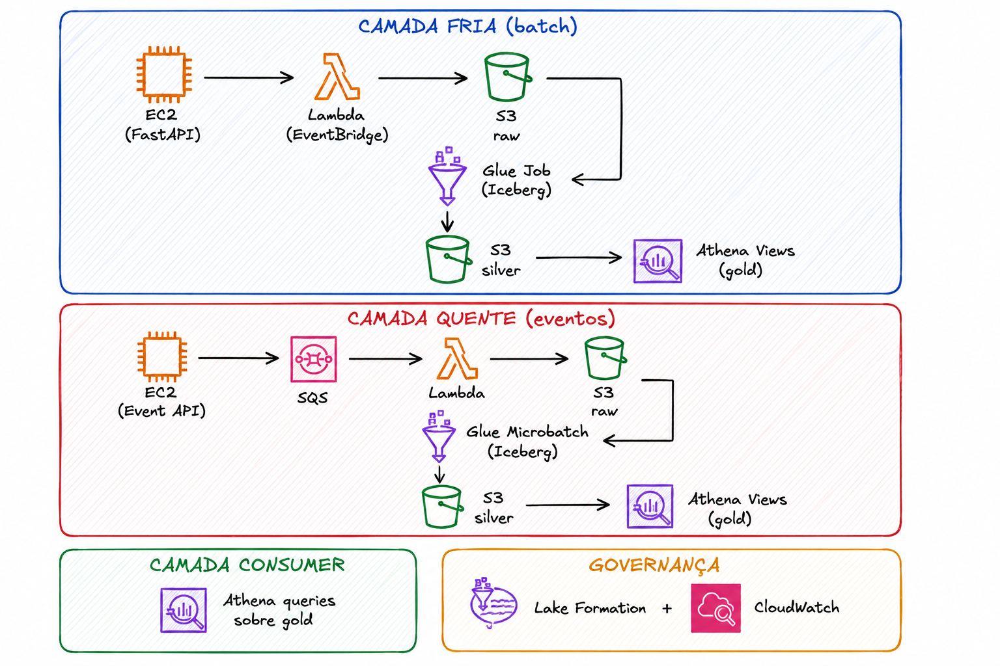

# ☁️ Projeto Base — Arquitetura AWS Lakehouse (Mentoria)

[](https://github.com/AlefRP/ementor-alef/actions/workflows/ci.yml)
[](https://sonarcloud.io/summary/new_code?id=aws_ementor-alef)
[](https://sonarcloud.io/summary/new_code?id=aws_ementor-alef)


Este repositório contém a estrutura inicial para um projeto de lakehouse na AWS, com separação entre camada fria, camada quente, camada de consumo, governança e esteira de dados via GitHub Actions.

**Objetivo:** permitir que o mentorado implemente os componentes de negócio sobre uma base pronta de organização, qualidade e pipeline.

---

## 🗺️ Diagrama da Arquitetura



---

## 🎯 Escopo da Arquitetura

### ❄️ Camada Fria (batch)

1. API de data product em FastAPI (deploy em EC2) para expor dados.
2. Lambda agendada via EventBridge para consumir a API e salvar na raw (S3).
3. Job Glue (agendado via EventBridge) para ler a raw e escrever a silver em Iceberg.
4. Views no Athena para criar a camada gold a partir da silver.

### 🔥 Camada Quente (eventos)

1. Gerador de eventos (data product) em API (deploy em EC2).
2. API publica eventos no SQS.
3. Lambda acionada pelo SQS persiste os dados na raw (S3).
4. Job Glue microbatch (agendado via EventBridge) transforma raw em silver (Iceberg).
5. Views no Athena disponibilizam a camada gold.

### 📊 Camada Consumer

- Consumo analítico de dados via Athena.

### 🛡️ Camada de Governança

- AWS Lake Formation para controle de permissões e governança do lakehouse.
- CloudWatch para observabilidade e monitoramento de toda a arquitetura.

---

## 🚀 Esteira de Dados (CI/CD)

Configurada com GitHub Actions e SonarCloud (gratuito para repositórios públicos), no padrão **merge-before-apply**: o `terraform plan` é revisado no PR e o merge na `master` dispara o apply automático do ambiente.

### ⚡ Gatilhos por evento

| Evento | Quality & Testes | Checks Terraform | Plan | Apply | SonarCloud |
| --- | :---: | :---: | :---: | :---: | :---: |
| PR → `main`/`master` | ✅ | ✅ | ✅ ¹ | ❌ | ✅ (Quality Gate bloqueia) |
| `push` na `main`/`master` (merge) | ✅ | ✅ | ✅ (auditoria) | ✅ automático | ✅ (atualiza o baseline) |
| Manual (`workflow_dispatch`) | ✅ | ✅ | ❌ | ❌ | ❌ |

¹ Somente PRs do próprio repositório — PR de fork não recebe secrets (regra do GitHub), então o job de plan nem tenta autenticar.

O apply executa **exatamente o plan salvo** no mesmo run (sem re-planejar entre plan e apply), e o precheck `make tf-ensure-bundle` publica o bundle da API do commit de merge antes do plan — inclusive no bootstrap do zero, quando o bucket de artefatos ainda não existe. O merge verde na `master` também dispara o CD (`release.yml`). Voltar atrás é sempre manual: workflows **Rollback** e **Destroy**.

O SonarCloud aguarda o Quality Gate (`sonar.qualitygate.wait`): reprova se a cobertura ficar abaixo de **90%** (threshold configurado no Quality Gate do projeto no SonarCloud).

### ✅ Gates de qualidade

| Gate | Ferramenta |
| --- | --- |
| 🎨 Formatação | `blue` + `isort` |
| 🧱 Compilação | `python -m compileall` |
| 🔒 Segurança | `bandit` + `pip-audit` |
| 🧪 Testes | `pytest` (unit / integration / TAAC) |
| 🏛️ Arquitetura (TAAC) | `pytest -m taac` (estático sobre o HCL + live via boto3) |
| 🌍 Infraestrutura | `terraform fmt/validate` + `tflint` + `checkov` (árvore inteira) + plan |
| 📈 Qualidade de código | SonarCloud (Quality Gate com cobertura ≥ 90%) |

### 📂 Arquivos da esteira

- `.github/workflows/ci.yml` — lint, segurança, testes (matrix Python 3.11/3.12/3.13), checks de Terraform, plan no PR e **apply automático no merge à master**
- `.github/workflows/sonar.yml` — cobertura + scan SonarCloud (PR e master — a análise da master atualiza o baseline de "new code")
- `.github/workflows/release.yml` — CD: calcula a versão semver por Conventional Commits, atualiza `pyproject.toml` + `CHANGELOG.md`, cria a tag `vX.Y.Z` e a GitHub Release com o bundle da API como asset
- `.github/workflows/rollback.yml` — rollback manual (checkout de tag/SHA antigo; modo `plan` para simular ou `apply` para executar; republica o bundle do ref alvo e salva o plan como artefato de auditoria)
- `.github/workflows/destroy.yml` — teardown manual do ambiente (confirmação digitada + opção `force` para esvaziar os buckets; preserva o bucket de state). O `force` roda um apply prévio (`make tf-force-arm`) que grava `force_destroy=true` no state: o provider AWS lê esse atributo do state ao deletar o bucket, então passar `-var` direto no `terraform destroy` não teria efeito e o teardown falharia com `BucketNotEmpty`
- `.github/dependabot.yml` — atualização automática de GitHub Actions, dependências pip e módulos Terraform
- `.pre-commit-config.yaml` — hooks locais que espelham os gates (blue, isort, bandit, detect-secrets, terraform fmt)
- `sonar-project.properties` — configuração do projeto no SonarCloud

O CI publica artefatos por execução: relatórios de cobertura (XML + HTML), resultados JUnit por versão de Python, relatórios de segurança em SARIF (aba Security → Code scanning) e o `terraform plan` (trilha de auditoria).

### 🔐 Secrets necessários no repositório GitHub

| Configuração | Tipo | Usado em |
| --- | --- | --- |
| `SONAR_TOKEN` | Secret | sonar.yml |
| `AWS_ACCESS_KEY_ID` | Secret | ci.yml (plan/apply) + rollback.yml + destroy.yml |
| `AWS_SECRET_ACCESS_KEY` | Secret | ci.yml (plan/apply) + rollback.yml + destroy.yml |
| `AWS_DEFAULT_REGION` | Variable (`us-east-1`) | ci.yml (plan/apply) + rollback.yml + destroy.yml |

Configure em Settings → Secrets and variables → Actions (ou no environment `prod`, que permite exigir aprovação manual antes dos jobs de Terraform). Use as credenciais de um IAM user dedicado (ex.: `github-actions`) — nunca do root.

---

## 📁 Estrutura de Pastas

Diretórios principais do repositório (itens "a criar" são os próximos passos da mentoria):

```text
.
|-- .claude/                        ← skills, agents, commands e lições (ver .claude/README.md)
|-- .github/
|   `-- workflows/                  ← ci, sonar, release (CD), rollback e destroy
|-- infra/
|   `-- terraform/
|       |-- bootstrap/              ← bucket do state remoto (apply único, manual)
|       |-- modules/                ← network, storage, database, messaging, governance,
|       |                             api_ec2, lambda_ingest, hot_ingestion, simulation/*
|       `-- environments/
|           `-- prod/               ← composição do ambiente de produção
|-- scripts/
|   |-- bundle/                     ← empacotamento das Lambdas e da API
|   |-- database/                   ← seed do dataset Olist no RDS
|   |-- deploy/                     ← precheck do bundle da API (gate do apply)
|   |-- release/                    ← versionamento semver (CD)
|   `-- teardown/                   ← esvaziamento de buckets versionados
|-- simulation/                     ← fora da arquitetura: alimenta o SQS e o RDS (Faker)
|   |-- db_seeder/                  ← Lambda de seed do RDS
|   `-- event_producer/             ← Lambda que publica eventos no SQS
|-- src/
|   |-- cold/                       ← camada fria
|   |   |-- api_orders/             ← API FastAPI async (data product Olist)
|   |   |-- lambda_ingest/          ← Lambda EventBridge → API → raw
|   |   |-- glue_silver/            ← a criar: job.py + config
|   |   `-- athena_gold/            ← a criar: DDL de views .sql
|   |-- hot/                        ← camada quente
|   |   |-- lambda_raw_ingest/      ← Lambda SQS → raw (batch item failures)
|   |   |-- glue_silver_microbatch/ ← a criar: job.py
|   |   `-- athena_gold/            ← a criar: DDL de views .sql
|   `-- consumer/                   ← a criar: queries analíticas (Athena)
|-- tests/
|   |-- unit/                       ← unitários (cold/ e hot/)
|   |-- integration/                ← integração (marker `integration`)
|   `-- taac/                       ← testes de arquitetura (estático + live)
|-- Makefile                        ← fonte única dos comandos (local e esteira)
|-- pyproject.toml
`-- sonar-project.properties
```

---

## 🏁 Como Começar

```bash
# 1. Criar e ativar o ambiente virtual
python -m venv .venv && source .venv/bin/activate

# 2. Instalar o projeto e as dependências (extras prod)
pip install -e .[prod]

# 3. Instalar os hooks de pre-commit (espelham os gates do CI)
make install-hooks

# 4. Rodar o gate local completo antes de qualquer commit
make quality        # check-format + lint + security + test
```

---

## 💡 Dicas de Implementação por Componente

### API FastAPI (camada fria)

- Definir contrato de dados versionado (schema + paginação).
- Incluir endpoint `/health` para o EventBridge/Lambda validar disponibilidade.
- Padronizar erros HTTP com `HTTPException` e correlation id nos logs.
- Dockerizar e criar script de deploy no EC2 (systemd ou supervisor).

### Lambda de ingestão batch

- Usar `boto3` para gravar no S3 com partições por `year/month/day/hour`.
- Implementar idempotência via checksum ou marker de última execução.
- Registrar métricas customizadas no CloudWatch (volume, latência, erros).

### Glue Silver com Iceberg

- Configurar `GlueContext` com catálogo Iceberg via Lake Formation.
- Definir estratégia de `MERGE INTO` para dados tardios.
- Agendar compactação periódica (`OPTIMIZE` + `VACUUM`) para controle de custo.
- Versionamento de schema habilitado por padrão no Iceberg.

### Athena Gold

- Criar views semânticas orientadas ao domínio de negócio.
- Versionar o DDL como arquivos `.sql` no repositório.
- Particionar a consulta para evitar full scan e reduzir custo.

### Camada quente (SQS + Lambda)

- Incluir `messageGroupId` e chave idempotente no payload do evento.
- Configurar Dead Letter Queue (DLQ) para eventos inválidos.
- Ajustar `batchSize` e `visibilityTimeout` do SQS conforme o throughput.

### Governança

- Lake Formation: criar `data lake locations`, registrar databases e aplicar `LF-tags` por domínio.
- CloudWatch: alarmes para `Lambda Errors`, `Glue Job Failures` e `SQS ApproximateNumberOfMessagesNotVisible`.

---

## 🔀 Dicas para o primeiro PR

- Implementar o caminho vertical mínimo da camada fria:
  `API → Lambda batch → S3 raw → Glue Silver → Athena Gold`.
- PR pequeno e focado, com testes unitários cobrindo o fluxo.
- Todos os checks da esteira devem estar verdes antes do merge.

---

## 📈 Configuração do SonarCloud

O projeto usa o **SonarCloud** (gratuito para repositórios públicos):

1. Acesse [sonarcloud.io](https://sonarcloud.io) e conecte com a sua conta GitHub.
2. Importe o repositório e copie o `projectKey` e a `organization`.
3. Atualize o `sonar-project.properties` com os valores corretos.
4. Adicione o secret `SONAR_TOKEN` nas configurações do repositório GitHub.

> `SONAR_HOST_URL` não é necessário — o workflow já aponta para `https://sonarcloud.io`.

---

## 📚 Referências

- [Terraform — Provider AWS](https://registry.terraform.io/providers/hashicorp/aws/latest/docs)
- [Introdução a Testes Unitários](https://www.youtube.com/watch?v=pZvhZ-Lr-PE)
- [Introdução a Testes com Mock](https://www.youtube.com/watch?v=8uiMnwIkPYA)
- [Pytest Fixtures](https://www.youtube.com/watch?v=sidi9Z_IkLU)
- [Playlist Desenvolvimento de uma lib — importante para aprender técnicas de programação profissional](https://www.youtube.com/watch?v=R3hCkU4EXgY)
- [Curso FastAPI — gratuito](https://www.youtube.com/watch?v=ImhYlISeWPQ&list=PLOQgLBuj2-3KT9ZWvPmaGFQ0KjIez0403)
- [Curso FastAPI — pago](https://www.udemy.com/course/fastapi-apis-modernas-e-assincronas-com-python/?referralCode=6E89EB8C04280DEA5983)
- [Curso AWS — Essencial](https://www.udemy.com/course/amazon-web-services-essencial/?referralCode=835315E4467A40447001)
- [Programação Assíncrona](https://www.udemy.com/course/programacao-concorrente-e-assincrona-com-python/?referralCode=CDFB0EDDE8648B7DDE15)
- [Curso Design Patterns](https://www.udemy.com/course/padroes-de-projeto-com-python/?referralCode=0BC87A15DEC26B50505B)
- [Design Patterns — documentação](https://refactoring.guru/design-patterns)
- [Livro de Computação](https://www.amazon.com.br/Cientista-Computa%C3%A7%C3%A3o-Autodidata-Estruturas-Algoritmos/dp/8575228374/ref=sr_1_1?__mk_pt_BR=%C3%85M%C3%85%C5%BD%C3%95%C3%91&crid=21HYZK2Y40TWD&dib=eyJ2IjoiMSJ9.k-TIy9ot0B7FvP05Tc4SQHxMum3WXb7YClwTRyVdjLdYyTGU56pOTqp4D6AKHqTpybcc860XhceEnb9gjSYP3G-HZBTW_aENE3u78mZv4UkNBo7iv_JDTYRcLQM7ymxWt3EK7xPNMLNjkUpC0q94sk0l9L29gwMJEQX-Ms-WfMwHNvKvS80a3oilKmbu-0Gl.0p77zmiCSmrdfCuzAKvrYNGCUcq1FSRizMqQlPoKz6k&dib_tag=se&keywords=Cientista+da+Computa%C3%A7%C3%A3o+Autodidata&qid=1778100752&s=books&sprefix=cientista+da+computa%C3%A7%C3%A3o+autodidata%2Cstripbooks%2C217&sr=1-1)
- [Curso Esteira de Dados](https://cursos.alura.com.br/formacao-devops)
- [Testes de Integração](https://www.youtube.com/watch?v=qq8b1bck9AU)
- [Pipeline Terraform — usar como referência](https://www.youtube.com/watch?v=1TNAUW7_bC0)
- [Curso Docker](https://www.udemy.com/course/docker-essencial-para-o-desenvolvedor/?referralCode=4180ED98E508AEAAE5FF)
- [ShadowTraffic](https://shadowtraffic.io/)
- [Curso de Claude Code — recomendado](https://www.youtube.com/watch?v=MzMM5iV3GcU)
