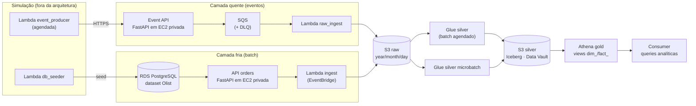

# Arquitetura — como o lakehouse funciona

> Parte da documentação do projeto — veja o [README](../README.md) para a visão
> geral, a [esteira CI/CD](esteira.md) e o [runbook de operação](operacao.md).

Este documento descreve o caminho do dado de ponta a ponta: onde a arquitetura
começa, o que cada componente faz e como o código em `src/` se conecta à infra
em `infra/terraform/`.

## A fronteira que organiza tudo

A arquitetura começa **na Event API** (camada quente) e **no RDS** (camada
fria). Tudo que *alimenta* essas duas fronteiras é **simulação** — no mundo
real seriam os sistemas de origem — e vive separado, em [`simulation/`](../simulation/)
e `infra/terraform/modules/simulation/`. Remover a simulação inteira não afeta
o lakehouse.

## ❄️ Camada fria, passo a passo

O dado nasce transacional e vira analítico em quatro saltos:

1. **RDS PostgreSQL** ([`modules/database`](../infra/terraform/modules/database)) —
   banco privado com o dataset Olist. A senha do master é um secret gerenciado;
   a API não a usa (ver abaixo).
2. **API de data product** ([`src/cold/api_orders/`](../src/cold/api_orders/),
   servida por [`modules/api_ec2`](../infra/terraform/modules/api_ec2)) — FastAPI
   async numa EC2 **privada** (sem IP público, sem SSH; acesso administrativo só
   via SSM Session Manager). Autentica no RDS com **IAM auth** (`DB_AUTH=iam`:
   token de 15 min assinado pela role da instância — nenhuma senha em lugar
   nenhum). Serve HTTPS com CA própria e IP privado fixo (SAN do certificado).
   O código chega como **bundle offline** (wheelhouse) via S3 gateway endpoint —
   a subnet não tem NAT.
3. **Lambda de ingestão** ([`src/cold/lambda_ingest/`](../src/cold/lambda_ingest/),
   [`modules/lambda_ingest`](../infra/terraform/modules/lambda_ingest)) — agendada
   por EventBridge, pagina a API por HTTPS (confiando na CA própria) e grava os
   datasets na **raw** em S3, sempre particionados `year/month/day`.
4. **Job Glue silver** ([`src/cold/glue_silver/job.py`](../src/cold/glue_silver/job.py),
   [`modules/glue_silver`](../infra/terraform/modules/glue_silver)) — agendado via
   EventBridge Scheduler, lê a raw e materializa o **Data Vault** na silver
   (Iceberg). Detalhes na seção [silver](#-camada-silver--raw-data-vault-sobre-iceberg).

A gold da camada fria são as views dimensionais em
[`src/cold/athena_gold/`](../src/cold/athena_gold/): `dim_customer`,
`dim_product`, `dim_seller`, `fact_order`, `fact_order_item`,
`fact_order_payment`, `fact_order_review`.

## 🔥 Camada quente, passo a passo

1. **Event API** ([`src/hot/api_events/`](../src/hot/api_events/), mesma infra
   genérica [`modules/api_ec2`](../infra/terraform/modules/api_ec2)) — é a
   **fronteira de entrada** dos eventos: valida o contrato (Pydantic) e publica
   no SQS. Como a EC2 é privada e não há NAT, o SQS é alcançado por um
   **interface endpoint** (o SQS não tem gateway endpoint gratuito).
2. **SQS + DLQ** ([`modules/messaging`](../infra/terraform/modules/messaging)) —
   fila de eventos com Dead Letter Queue para mensagens que falham repetidamente.
3. **Lambda de ingestão** ([`src/hot/lambda_raw_ingest/`](../src/hot/lambda_raw_ingest/),
   [`modules/hot_ingestion`](../infra/terraform/modules/hot_ingestion)) — consumida
   pelo SQS, grava os eventos na raw com **batch item failures**: só a mensagem
   que falhou volta para a fila, o resto do lote é confirmado.
4. **Job Glue microbatch** ([`src/hot/glue_silver_microbatch/job.py`](../src/hot/glue_silver_microbatch/job.py)) —
   agendado com frequência maior que o batch frio, transforma a raw de eventos
   na silver (mesmo runtime Data Vault).

A gold da camada quente ([`src/hot/athena_gold/`](../src/hot/athena_gold/))
expõe `fact_order_event` e a agregação `agg_order_event_hourly`.

## 🥈 Camada silver — Raw Data Vault sobre Iceberg

Os dois jobs Glue compartilham o runtime
[`src/glue_silver_runtime/`](../src/glue_silver_runtime/), que vai para o zip do
job via `--extra-py-files` (por isso os imports são *flat* — `from vault import ...`).

- **Modelagem**: Raw Data Vault (DV 2.0) — `vault.py` define specs declarativas:
  - **Hub**: uma linha por chave de negócio, identificada por hash key
    (ex.: `hub_customer`).
  - **Link**: relacionamento entre hubs, com *dependent child keys* quando preciso.
  - **Satellite**: contexto descritivo do pai, versionado por `hashdiff`.
  - **Reference**: lookup descritivo que não é objeto de negócio (estado corrente).
- **Specs por camada**: [`cold_specs.py`](../src/glue_silver_runtime/cold_specs.py)
  (datasets Olist do RDS) e [`hot_specs.py`](../src/glue_silver_runtime/hot_specs.py)
  (eventos). Um caso que integra as duas camadas: no Olist, `customer_id` é único
  **por pedido**; a identidade real é `customer_unique_id`. O `hub_customer` usa a
  chave de negócio real e um *same-as link* mapeia conta → cliente.
- **Escrita idempotente** ([`iceberg.py`](../src/glue_silver_runtime/iceberg.py)):
  cada artefato tem a estratégia de merge que o DV pede — hubs/links são
  **insert-only por hash key**; satellites inserem nova versão quando o
  `hashdiff` difere **do registro mais recente** da chave (comparar com a
  história inteira suprimiria reativações A → B → A); references fazem upsert.
  Reprocessar a silver é seguro por construção.
- **Nomes**: tabelas e colunas seguem o dataset Olist e o padrão DV em inglês
  (`hub_customer`, `hashdiff`); as funções do código são em PT-BR
  (`montar_hub`, `configurar_iceberg`).

## 🥇 Camada gold — views, não cópia

A gold **não copia dados**: são views do Athena sobre a silver, devolvendo o
modelo dimensional (`dim_`/`fact_`) que o negócio entende.

- O Terraform ([`modules/athena_gold`](../infra/terraform/modules/athena_gold))
  cria só a **infra**: database e workgroup.
- O **DDL é código**, versionado em `src/{cold,hot}/athena_gold/*.sql` e aplicado
  por [`scripts/athena/apply_views.py`](../scripts/athena/apply_views.py)
  (`make athena-gold` — `CREATE OR REPLACE VIEW`, idempotente).
- A esteira aplica as views **no merge à master**, depois do apply do Terraform
  e de rodar a silver (as views leem tabelas que precisam existir) — ver
  [esteira.md](esteira.md).

A ponta final é a **camada consumer**: queries analíticas versionadas em
[`src/consumer/`](../src/consumer/), executadas com
`make athena-query QUERY=<nome>`.

## 🛡️ Governança, rede e observabilidade

- **Lake Formation** ([`modules/governance`](../infra/terraform/modules/governance)):
  os buckets raw/silver são registrados como *data lake locations*; as roles de
  execução (Glue, Lambdas, EC2) recebem grants mínimos; analistas humanos
  (variável `analistas`) recebem grants de **consumo** (SELECT/DESCRIBE) na
  silver e na gold — no Lake Formation, ser admin não dá leitura de dados:
  SELECT é sempre grant explícito.
- **IAM least-privilege**: cada componente tem role própria com acesso restrito
  aos prefixos S3/recursos que usa; nunca `Action: "*"`. O deployer (user da
  esteira) não é admin.
- **Rede** ([`modules/network`](../infra/terraform/modules/network)): subnets
  privadas, **sem NAT**. O S3 entra por gateway endpoint (gratuito); SSM e SQS
  por interface endpoints. As EC2 não têm SSH — diagnóstico via Session Manager
  e logs de boot enviados ao S3.
- **Observabilidade** ([`modules/observability`](../infra/terraform/modules/observability)):
  todo componente loga estruturado (JSON) em log group próprio, e há **alarmes**
  para erro nas Lambdas de ingestão, mensagem na DLQ, backlog envelhecendo na
  fila e status check das EC2 privadas. Falha de job Glue tem caminho próprio
  (EventBridge → SNS → e-mail).

## Mapa código ↔ infra

| Componente | Código | Módulo Terraform |
| --- | --- | --- |
| API de data product (fria) | [`src/cold/api_orders/`](../src/cold/api_orders/) | [`api_ec2`](../infra/terraform/modules/api_ec2) (genérico, serve as duas APIs) |
| Lambda de ingestão fria | [`src/cold/lambda_ingest/`](../src/cold/lambda_ingest/) | [`lambda_ingest`](../infra/terraform/modules/lambda_ingest) |
| Event API (quente) | [`src/hot/api_events/`](../src/hot/api_events/) | [`api_ec2`](../infra/terraform/modules/api_ec2) |
| Fila de eventos + DLQ | — | [`messaging`](../infra/terraform/modules/messaging) |
| Lambda de ingestão quente | [`src/hot/lambda_raw_ingest/`](../src/hot/lambda_raw_ingest/) | [`hot_ingestion`](../infra/terraform/modules/hot_ingestion) |
| Jobs Glue silver | [`src/cold/glue_silver/`](../src/cold/glue_silver/) + [`src/hot/glue_silver_microbatch/`](../src/hot/glue_silver_microbatch/) + [`src/glue_silver_runtime/`](../src/glue_silver_runtime/) | [`glue_silver`](../infra/terraform/modules/glue_silver) |
| Views gold + workgroup | [`src/cold/athena_gold/`](../src/cold/athena_gold/) + [`src/hot/athena_gold/`](../src/hot/athena_gold/) | [`athena_gold`](../infra/terraform/modules/athena_gold) |
| Banco de origem (Olist) | [`scripts/database/`](../scripts/database/) | [`database`](../infra/terraform/modules/database) |
| Buckets das camadas | — | [`storage`](../infra/terraform/modules/storage) (raw, silver, artifacts) |
| Governança (LF + IAM) | — | [`governance`](../infra/terraform/modules/governance) |
| Alarmes | — | [`observability`](../infra/terraform/modules/observability) |
| Simulação | [`simulation/`](../simulation/) | [`simulation/event_producer`](../infra/terraform/modules/simulation/event_producer) + [`simulation/db_seeder`](../infra/terraform/modules/simulation/db_seeder) |

A composição de tudo isso está em
[`infra/terraform/environments/prod/main.tf`](../infra/terraform/environments/prod/main.tf),
que é a melhor leitura única para entender como os módulos se conectam.

## Simulação — o que fica de fora

Dois componentes existem só para o laboratório ter dados; num cenário real são
os sistemas de origem:

- **`event_producer`** — Lambda agendada que gera eventos (Faker) e **chama a
  Event API por HTTPS**. Ela não publica no SQS: quem publica é a API, que é a
  fronteira da arquitetura.
- **`db_seeder`** — Lambda que cria o schema, popula o Olist no RDS e cria o
  usuário de leitura da API. Invocada sob demanda (`make seed-db`).

Por ir no zip das Lambdas, `simulation/` passa pelos gates de formato e
segurança, mas **fica fora da cobertura e sem testes** — é simulação, não
lógica de negócio.
