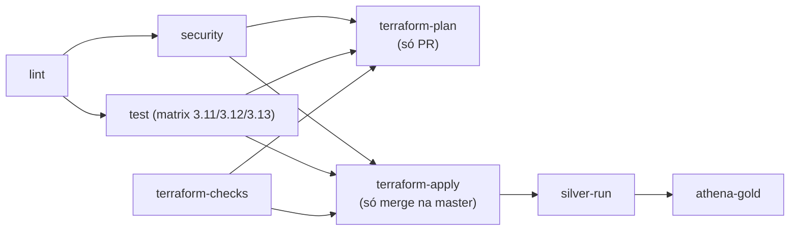

# Esteira CI/CD — como o código chega em produção

> Parte da documentação do projeto — veja o [README](../README.md) para a visão
> geral, a [arquitetura](arquitetura.md) e o [runbook de operação](operacao.md).

A esteira usa GitHub Actions + SonarCloud no padrão **merge-before-apply**
(referência HashiCorp): o `terraform plan` é revisado **no PR** e o merge na
`master` dispara o apply automático. Dois princípios atravessam tudo:

1. **O Makefile é a fonte única dos comandos** — o que a esteira roda é o mesmo
   `make <alvo>` que roda local. Se passou no `make quality` local, o CI tende a
   passar.
2. **O apply executa exatamente o plan salvo** no mesmo run (sem re-planejar
   entre plan e apply), e o plan fica como artefato de auditoria.

## ⚡ Gatilhos por evento

| Evento | Quality & Testes | Checks Terraform | Plan | Apply | SonarCloud |
| --- | :---: | :---: | :---: | :---: | :---: |
| PR → `main`/`master` | ✅ | ✅ | ✅ ¹ | ❌ | ✅ (Quality Gate bloqueia) |
| `push` na `main`/`master` (merge) | ✅ | ✅ | ✅ (auditoria) | ✅ automático | ✅ (atualiza o baseline) |
| Manual (`workflow_dispatch`) | ✅ | ✅ | ❌ | ❌ | ❌ |

¹ Somente PRs do próprio repositório — PR de fork não recebe secrets (regra do
GitHub), então o job de plan nem tenta autenticar. Os demais gates rodam também
em fork.

Push em branch de trabalho **não** dispara a esteira (com PR aberto, o par
push+pull_request rodava tudo em dobro). Feedback antes do PR: `make quality`.
Em PRs, um push novo cancela o run anterior; na `master` nunca — interromper um
apply no meio deixa a infra em estado parcial.

## 🧭 O fluxo do `ci.yml`

| Job | O que faz |
| --- | --- |
| `lint` | `make check-format` (blue + isort) e `make lint` (compileall) |
| `security` | `make security` (pip-audit + bandit, **bloqueante**) + SARIF do bandit para a aba Security (não bloqueia) |
| `test` | pytest com cobertura + JUnit em matrix 3.11/3.12/3.13, mais `make test-taac` (testes de arquitetura; os live pulam sem credenciais) |
| `terraform-checks` | fmt/validate/tflint/checkov **sem AWS**, na árvore inteira. O setup do TFLint tem retry (download de release do GitHub sofre 5xx transitório). O SARIF do checkov é filtrado antes do upload: achados já suprimidos com `#checkov:skip` no HCL não viram alertas de code scanning ([`scripts/ci/filter_sarif.py`](../scripts/ci/filter_sarif.py)) |
| `terraform-plan` | Só em PR do próprio repo: builda/publica o bundle da API, roda `make tf-plan-out` (autentica via STS) e sobe o `plan.txt` como artefato — é o que o merge vai aplicar |
| `terraform-apply` | Só no push da master: `tf-ensure-bundle` (publica o bundle do commit de merge), plan de auditoria, `tf-apply-plan` (aplica **exatamente** o plan salvo), depois `make silver-run` e `make athena-gold` |

Por que o apply roda `silver-run` antes de `athena-gold`: as views da gold leem
as tabelas Data Vault da silver, que num ambiente recém-aplicado ainda não
existem (o job Glue é agendado, não roda no apply). A esteira dispara a silver,
espera o `SUCCEEDED` e só então aplica as views — senão o
`CREATE OR REPLACE VIEW` quebraria com "Table ... does not exist".

O apply e os workflows de rollback/destroy compartilham o mesmo grupo de
concurrency (`terraform-state-<env>`): operações sobre o state nunca rodam em
paralelo.

## 📈 SonarCloud (`sonar.yml`)

Roda cobertura e o scan em PR e na master (a análise da master atualiza o
baseline de "new code"). O workflow espera o Quality Gate
(`sonar.qualitygate.wait`) e **reprova se a cobertura ficar abaixo de 90%** —
o threshold vive no Quality Gate do projeto no SonarCloud, espelhado localmente
por `make test-cov`.

Configuração inicial:

1. Acesse [sonarcloud.io](https://sonarcloud.io) e conecte com a sua conta GitHub.
2. Importe o repositório e copie o `projectKey` e a `organization` **da tela
   Information do projeto** (chaves inventadas quebram o scan com "project not
   found").
3. Atualize o [`sonar-project.properties`](../sonar-project.properties).
4. Adicione o secret `SONAR_TOKEN` no repositório GitHub.

> `SONAR_HOST_URL` não é necessário — o workflow já aponta para `https://sonarcloud.io`.

## 🚀 CD e operações manuais

- **`release.yml`** — dispara no merge verde da master: calcula a próxima versão
  semver por Conventional Commits, atualiza `pyproject.toml` + `CHANGELOG.md`,
  cria a tag `vX.Y.Z` e a GitHub Release com o bundle da API como asset
  ([`scripts/release/release.py`](../scripts/release/release.py)).
- **`rollback.yml`** — manual: checkout de uma tag/SHA antigo, republica o bundle
  do ref alvo e roda em modo `plan` (simulação) ou `apply` (executa). O plan é
  salvo como artefato de auditoria.
- **`destroy.yml`** — teardown manual do ambiente, com confirmação digitada. A
  opção `force` roda um apply prévio (`make tf-force-arm`) que grava
  `force_destroy=true` **no state** dos buckets e do workgroup do Athena — o
  provider lê esse atributo do state ao deletar, então `-var` direto no destroy
  não teria efeito e o teardown falharia com `BucketNotEmpty` / "WorkGroup is
  not empty". O bucket de state é preservado por design.

Detalhes de execução (comandos, ordem, precheck) no
[runbook de operação](operacao.md).

## 🔄 Manutenção automática e hooks locais

- [`.github/dependabot.yml`](../.github/dependabot.yml) — atualização automática
  de GitHub Actions, dependências pip e módulos Terraform.
- [`.pre-commit-config.yaml`](../.pre-commit-config.yaml) — hooks locais que
  espelham os gates (blue, isort, bandit, detect-secrets, terraform fmt).
  Instale com `make install-hooks`.

## 📦 Artefatos por execução

O CI publica: relatórios de cobertura (XML + HTML), resultados JUnit por versão
de Python, relatórios de segurança em SARIF (aba Security → Code scanning) e o
`terraform plan` (trilha de auditoria).

## 🔐 Secrets e variáveis no GitHub

| Configuração | Tipo | Usado em |
| --- | --- | --- |
| `SONAR_TOKEN` | Secret | sonar.yml |
| `AWS_ACCESS_KEY_ID` | Secret | ci.yml (plan/apply) + rollback.yml + destroy.yml |
| `AWS_SECRET_ACCESS_KEY` | Secret | ci.yml (plan/apply) + rollback.yml + destroy.yml |
| `AWS_DEFAULT_REGION` | Variable (`us-east-1`) | ci.yml (plan/apply) + rollback.yml + destroy.yml |

Configure em Settings → Secrets and variables → Actions (ou no environment
`prod`, que permite exigir aprovação manual antes dos jobs de Terraform). Use
as credenciais de um IAM user dedicado (ex.: `github-actions`) — nunca do root.
